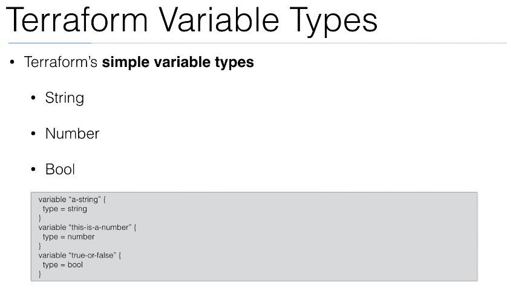
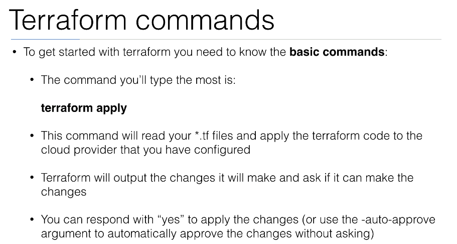
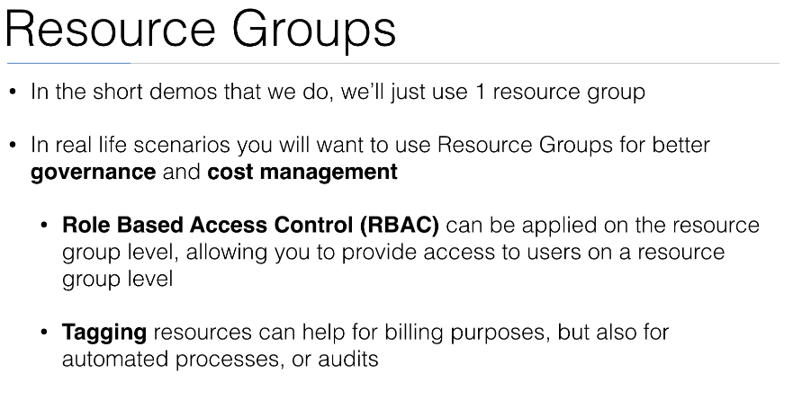

# DevOps expert using Terraform on Azure

https://github.com/in4it/terraform-azure-course
## Table of Contents

- [DevOps expert using Terraform on Azure](#devops-expert-using-terraform-on-azure)
  - [Table of Contents](#table-of-contents)
  - [Intstall](#intstall)
  - [Introduction to terraform HCL](#introduction-to-terraform-hcl)
    - [Var, types, ...](#var-types-)
    - [Commands](#commands)
  - [Terraform with Azure](#terraform-with-azure)
    - [Resource Group](#resource-group)
    - [Virtual Networks](#virtual-networks)
    - [Virtual Machine](#virtual-machine)
    - [Network Security Group](#network-security-group)
  - [Azure Services](#azure-services)
  - [Advanced Terraform](#advanced-terraform)
  - [More Azure Services](#more-azure-services)

## Intstall

- [terraform](https://www.terraform.io/)
- [azure](https://docs.microsoft.com/it-it/cli/azure/install-azure-cli-macos?view=azure-cli-latest)

## Introduction to terraform HCL

[Configuration Language](https://www.terraform.io/docs/configuration/index.html) 

- [variables](https://www.terraform.io/docs/configuration/variables.html)
- [functions](https://www.terraform.io/docs/configuration/functions/)
- [resources](https://www.terraform.io/docs/configuration/resources.html) require -[providers](https://www.terraform.io/docs/configuration/providers.html)
- []

see `p7b-terraform-test/main.tf`
```tf

> var.myvar
hello terraform

> "${var.myvar}"
hello terraform
```

```tf
> var.mymap
{
  "1" = "valore"
  "valore" = "20000"
}
> var.myvar[valore]

> var.mymap["valore"]
20000
```

```
> var.mylist
[
  "1",
  "2",
  "3",
  "fefq",
]

> var.mylist[2]
3
> element(var.mylist, 2)
3
> slice(var.mylist, 1,3)
[
  "2",
  "3",
]
```

see `p7b-terraform-test/resources.tf`

ogni volta che si aggiunge o modifica una `resource`

```
terraform init
```

poi

```
terraform console
```

e scrivi 

```
> var.AMIS[var.AWS_REGION]
my ami
```

---

### Var, types, ...





### Commands



---

`01_first-steps` 

**What is my public IP**

https://www.whatsmyip.org/

`curl ifconfig.so`

**Generate my public key**

```
ssh-keygen -f mykey
```


## Terraform with Azure

### Resource Group





[providers](https://www.terraform.io/docs/providers/index.html)

`02_resource-group` 

```
cd 02_resource-group

terraform init

terraform apply

### then type `yes`

(base) $ terraform console
> var.location
westeurope
> azurerm_resource_group.demo.id
/subscriptions/3cdf66cf-94eb-4c70-b74c-5c9a21d7a4e3/resourceGroups/resource-group-demo
> azurerm_resource_group.demo.name
resource-group-demo
> azurerm_resource_group.demo.location
westeurope
> azurerm_resource_group.demo.tags
{
  "env" = "resource-group-demo"
}
> azurerm_resource_group.demo.tags["env"]
resource-group-demo

```

### Virtual Networks


### Virtual Machine


### Network Security Group


## Azure Services


## Advanced Terraform


## More Azure Services


